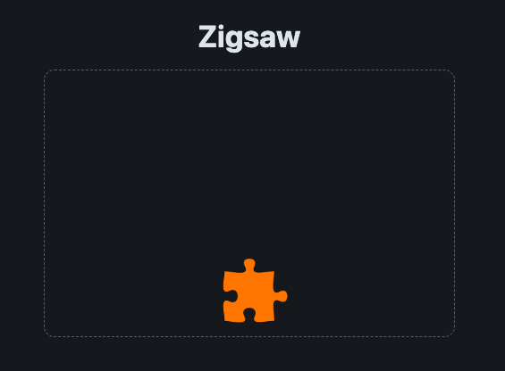
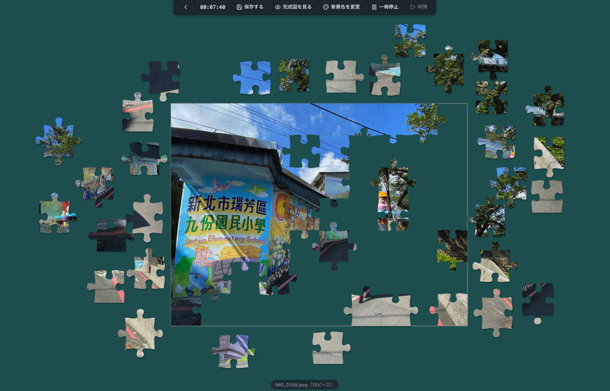
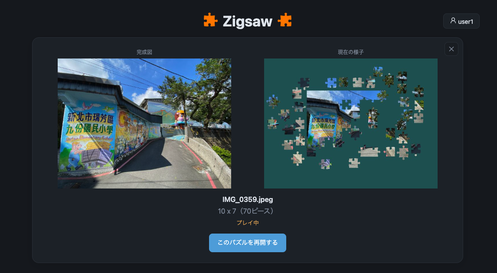

# Zigsaw（Web 版）

好きな画像からジグソーパズルを作って遊べる Web アプリです。
[macOS 版 Zigsaw](https://github.com/peanutsjamjam/Zigsaw) の移植です。

## できること

- サーバーのギャラリーにある画像から、好きなピース数でジグソーパズルを作って遊べます。
- ログイン（メールアドレス＋パスワード）すると、途中の状態を保存して中断し、あとで再開できます。
- 画像をアップロードして、みんなで遊べるパズルにできます。
- 背景色を自由に変更できます。
- 経過時間の表示・非表示を切り替え可能です。

## 遊ぶ

- https://zigsaw.peanutsjamjam.jp/

## 開発

技術的な構成・API・開発フローは [docs/DEVELOPMENT.md](docs/DEVELOPMENT.md) を参照してください。
